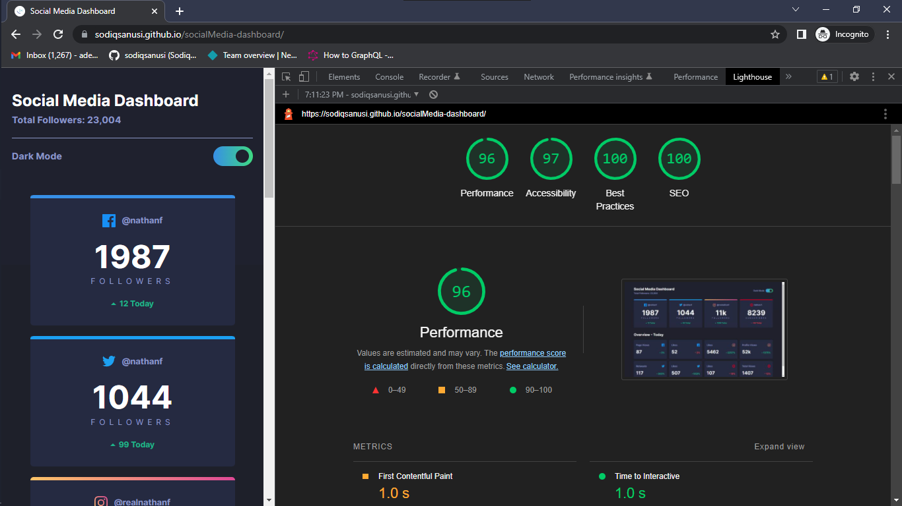

# Social Media Dashboard

This is a solution to the [Social Media Dashboard challenge on Frontend Mentor](https://www.frontendmentor.io/challenges/social-media-dashboard-with-theme-switcher-6oY8ozp_H/). Frontend Mentor challenges help you improve your coding skills by building realistic projects, though my main aim was quite different on this one.

## Table of contents

- [Overview](#overview)
  - [The challenge](#the-challenge)
  - [Screenshot](#screenshot)
  - [Links](#links)
- [My process](#my-process)
  - [Built with](#built-with)
  - [What I learned](#what-i-learned)
  - [Continued development](#continued-development)
- [Author](#author)
- [Acknowledgments](#acknowledgments)

## Overview
The goal was to build a replica of the designs provided, yes. But this time I also wanted to try doing more than was required.

The design had a theme option, so I tried to make the theming very dynamic by using the user's system preferences alongside live changes through the theme toggle button in the website.

### The challenge

Your users should be able to:

- View the optimal layout for the site depending on their device's screen size
- See hover states for all interactive elements on the page
- Toggle color theme to their preference
- See their theming preference reflected even before load (there shouldn't be a flash of unwanted colours).

### Screenshot

### Links

- Solution URL: [https://github.com/sodiqsanusi/socialMedia-dashboard/](https://github.com/sodiqsanusi/socialMedia-dashboard/)
- Live Site URL: [https://sodiqsanusi.github.io/socialMedia-dashboard/](https://sodiqsanusi.github.io/socialMedia-dashboard/)

## My process

To be honest, this was how I actually built this up
1. Sketched out the HTML structure of the site on paper.
2. Wrote the HTML code following the sketched-out structure.
3. Started styling for mobile/small screen devices.
4. Made the site responsive for large screen devices.
5. Tweaked styles, then worked on functionalities.
6. Used Lighthouse tool to check for possible improvements, then tweaked things using the gotten feedback.

**NB: This is getting to be a default workflow for me, hopefully I get better as I iterate on it.**

### Built with

- Semantic HTML5 markup
- CSS custom properties
- Flexbox
- CSS Grid
- Mobile-first workflow

### What I learned

Haven't built or coded for a while due to school, so this was a practise to check how rusty I've become. Apparently, I'm pretty slow now. 

Nonetheless, I'll keep trying to see how things can go, if I'll be able to combine my frontend journey with school (not looking possible atm tho.)

### Continued development

Everything. For now I just want to get back to the groove of creating pretty interfaces, will keep up with my learning path later.

> (Totally unrelated) Teslim Alabi is handsome af🙂

## Author

- Frontend Mentor - [@sodiqsanusi](https://www.frontendmentor.io/profile/sodiqsanusi)
- Twitter - [@sodiqsanusi0](https://www.twitter.com/sodiqsanusi0)

## Acknowledgments
*to me and mine, thanks.*
